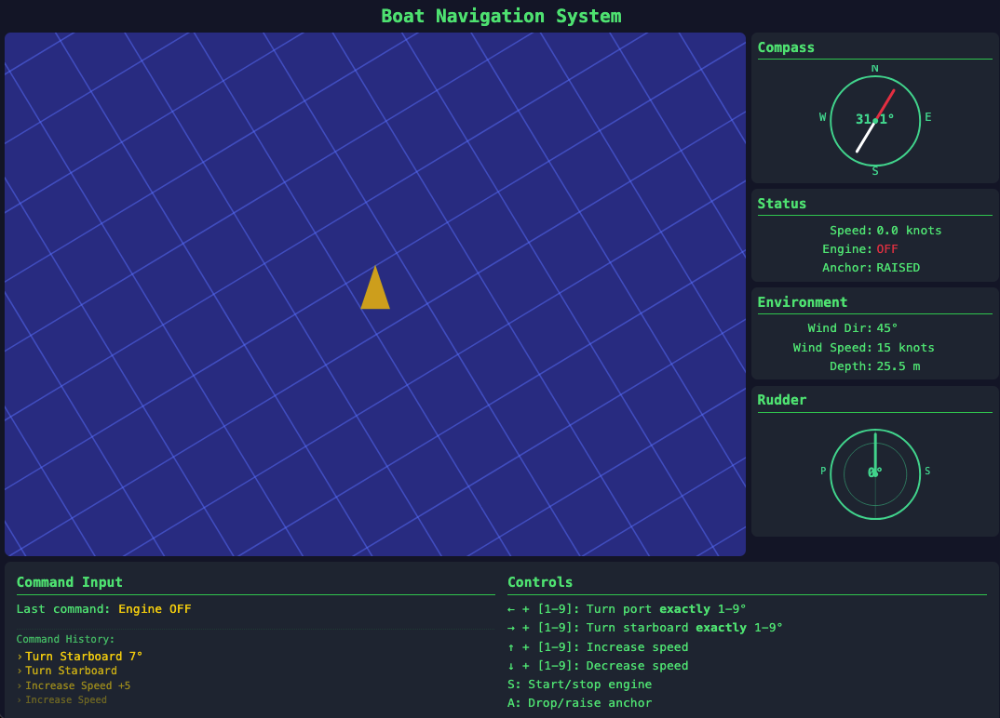

# Barbaros - Boat Navigation Simulator

An almost realistic boat navigation system simulator with interactive controls and a dynamic visualization. Now featuring voice control for a hands-free navigation experience.



## Features

- Real-time boat navigation with realistic marine physics
- Interactive keyboard controls for steering and speed management
- Visual dashboard with compass, rudder angle, and environmental information
- Command history that tracks your previous actions
- Realistic turning mechanics based on speed and rudder angle
- Visual wake effects that respond to the boat's movement
- **NEW**: Voice commands for hands-free navigation

## Controls

### Keyboard Controls

- **←** + **[1-9]**: Turn port exactly 1-9°
- **→** + **[1-9]**: Turn starboard exactly 1-9°
- **↑** + **[1-9]**: Increase speed by 1-9 knots
- **↓** + **[1-9]**: Decrease speed by 1-9 knots
- **S**: Start/stop engine
- **A**: Drop/raise anchor

### Voice Controls

Speak commands naturally after saying the wake word "Barbaros":

- "Turn port/left 5 degrees"
- "Turn starboard/right 3 degrees" 
- "Speed up 2 knots"
- "Slow down 1 knot"
- "Start engine" / "Stop engine"
- "Drop anchor" / "Raise anchor"

## Technology

Built with React and modern JavaScript, using:
- React Hooks for state management
- SVG for fluid animations and visualizations
- CSS for responsive layout and styling
- WebSockets for real-time voice command communication
- OpenAI Whisper API for speech recognition
- OpenAI GPT API for natural language intent recognition

## Development

### Prerequisites

- Node.js (v14.0.0 or higher)
- npm (v6.0.0 or higher)
- Python 3.8+ (for voice backend)
- OpenAI API key (for voice recognition)

### Installation

```bash
# Clone the repository
git clone https://github.com/alpoktem/barbaros-demo.git
cd barbaros-demo

# Install dependencies
npm install

# Install voice backend dependencies
cd voice-backend
pip install -r requirements.txt
cd ..

# Start the development server
npm start
```

### Running the Voice Backend

The voice control system requires running a separate Python backend:

```bash
cd voice-backend

# Set your OpenAI API key
export OPENAI_API_KEY=your_api_key_here

# Run with default wake word model
python barbaros-voice-server.py

# Or run with the specific wake word model
python barbaros-voice-server.py --model_path bahrbah_rows.onnx --inference_framework onnx
```

After starting the voice backend, open the voice test client at http://localhost:9000/ to interact with the system.

For more information about the wake word detection system, visit [openWakeWord on GitHub](https://github.com/dscripka/openWakeWord).

### Building for Production

```bash
npm run build
```

## Project Structure

- `src/components/`: UI components for the dashboard and visualization
- `src/hooks/`: Custom React hooks, including the boat physics engine
- `src/styles.css`: Global styles and theming
- `voice-backend/`: Python server for voice recognition and command processing

## Marine Physics Simulation

The simulator emulates realistic marine physics including:
- Momentum and inertia effects
- Speed-dependent turning dynamics
- Realistic rudder behavior
- Environmental factors like wind direction and water depth

## Voice Control Architecture

The voice control system consists of three main components:

1. **Voice Test Client** - Browser interface for microphone access
2. **Voice Backend Server** - Python server that processes audio:
   - Wake word detection using openWakeWord
   - Speech recognition using OpenAI Whisper API
   - Intent recognition using OpenAI GPT API
3. **Boat UI Integration** - Real-time command execution via WebSockets

The system shows visual feedback for different states:
- **Barbaros inactive** - Voice server not connected
- **Barbaros connected** - Ready for wake word detection
- **Barbaros listening** - Wake word detected, recording command
- **Barbaros thinking** - Processing speech to text and recognizing intent
- **Barbaros executing** - Executing recognized command